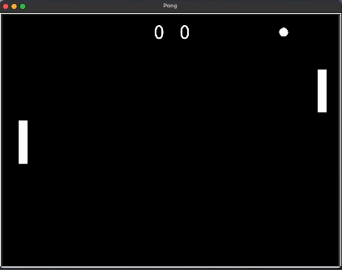

<div align="center"> The Pong Game <br/> <br/>  </div>

# Pong Game in Python

## Overview

This is a simple implementation of the classic Pon Game using Python and Object-Oriented Programming (OOP) principles and the Turtle graphics library. This project recreates the iconic Pong experience, allowing two players to compete in a virtual game of table tennis.


## Features

- Object-oriented design for clean code structure and easy maintenance.
- Utilizes the Turtle graphics library for simple and interactive visuals.
- Two-player mode for head-to-head competition.
- Score tracking to determine the winner.

## Requirements

- Python 3.x

## How to Play

1. **Clone the repository:**

    ```bash
    git clone https://github.com/sepidehkhakzad/Pong.git
    ```

2. **Navigate to the project directory:**

    ```bash
    cd Pong
    ```

3. **Run the game:**

    ```bash
    python main.py
    ```

4. **Player 1 controls:**
   - `W` to move the paddle up
   - `S` to move the paddle down

5. **Player 2 controls:**
   - Up arrow key to move the paddle up
   - Down arrow key to move the paddle down

6. **The game ends when one player reaches the score limit, or you can exit the game at any time.**

## File Structure

- `main.py`: Main Python script containing the game logic and implementation.
- `paddle.py`: Paddle object class to keep track of the movement of the paddles.
- `ball.py`: Ball object class to keep track of the position of the ball and change it after every collision.
- `scoreboard.py`: Scoreboard object class to keep track of the scores.
- `README.md`: Documentation file providing information about the project.

Here's a demo of how the game works:

<p align="center">
  
</p>

## Acknowledgments

- This project is a tribute to the classic Pong game, a pioneer in the world of video games.
- Special thanks to the Turtle graphics library for making graphics programming in Python fun and accessible.

## Contribution

Contributions are encouraged! Feel free to submit issues or pull requests to enhance the game.

## License

This Pong Game project is licensed under the Apache License.

Enjoy the game! 🏓🎮


